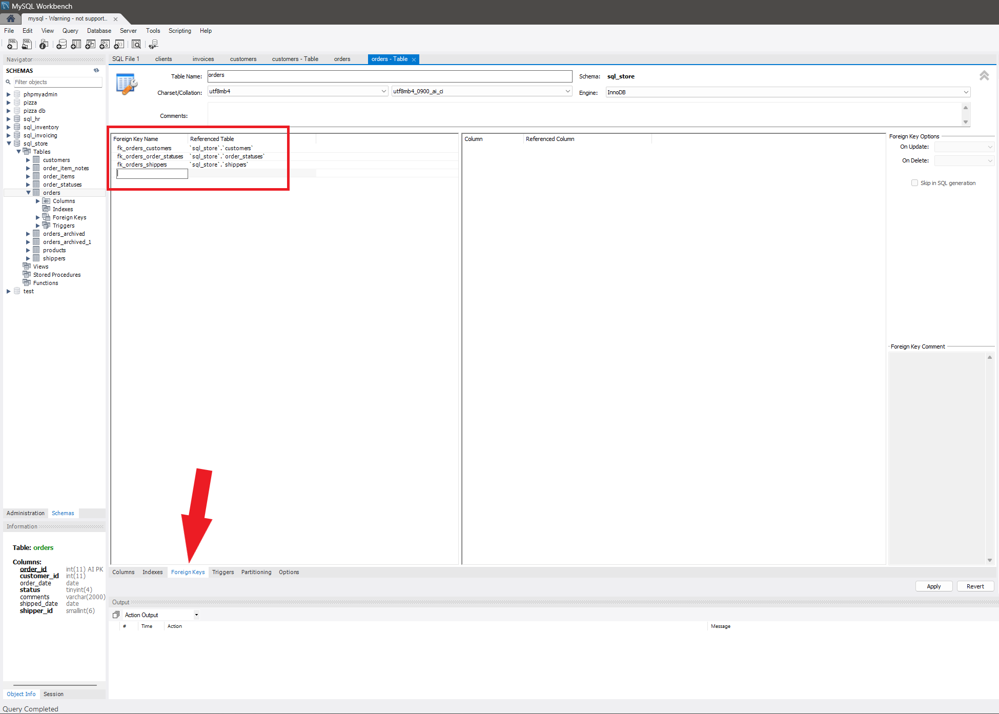

# Foreign Keys
A foreign key is a column or a set of columns in a table that establishes a link between data in two tables. It is a field (or collection of fields) in one table that refers to the primary key in another table.

### Importance
Foreign keys maintain the referential integrity of your data, ensuring that relationships between tables remain consistent. They prevent actions that would destroy links between tables and help maintain the accuracy and consistency of data.

### Foreign Key Constraints
**Referential Integrity**
Foreign key constraints ensure that the relationships between tables are preserved. For example, a foreign key constraint prevents inserting a record in a child table that does not have a corresponding record in the parent table.

**Relationships Between Tables**
Foreign keys define and enforce relationships between tables, such as one-to-one, one-to-many, and many-to-many relationships.

### Types of Foreign Keys
**Single-Column Foreign Keys**
A single-column foreign key uses one column to reference a single column (usually a primary key) in another table.

**Composite Foreign Keys**
A composite foreign key uses two or more columns to reference a primary key or a unique key in another table. Composite keys are used when a single column is insufficient to enforce the relationship.

### Creating Foreign Keys
**Creating Foreign Keys on New Tables**
Foreign keys are defined using the FOREIGN KEY constraint within the CREATE TABLE statement.

```sql
CREATE TABLE orders (
    order_id INT(11) AUTO_INCREMENT,
    customer_id INT(11),
    order_date DATE,
    status TINYINT(4),
    comments VARCHAR(2000),
    shipped_date DATE,
    shipper_id SMALLINT(6),
    PRIMARY KEY (order_id),
    FOREIGN KEY (customer_id) REFERENCES customers(customer_id)
);
```

**Adding Foreign Keys to Existing Tables**
Foreign keys can be added to existing tables using the ALTER TABLE statement.

```sql
ALTER TABLE orders ADD CONSTRAINT fk_customer FOREIGN KEY (customer_id) REFERENCES customers(customer_id);
```


### Cascading Actions
**ON DELETE CASCADE**
This option allows automatic deletion of rows in the child table when the corresponding row in the parent table is deleted.

```sql
FOREIGN KEY (customer_id) REFERENCES customers(customer_id) ON DELETE CASCADE;
```

**ON UPDATE CASCADE**
This option allows automatic updates of foreign key values in the child table when the corresponding value in the parent table is updated.

```sql
FOREIGN KEY (customer_id) REFERENCES customers(customer_id) ON UPDATE CASCADE;
```

### Other Cascading Options
* `ON DELETE SET NULL:` Sets the foreign key column to NULL when the referenced row is deleted.
* `ON DELETE SET DEFAULT:` Sets the foreign key column to its default value when the referenced row is deleted.
* `ON UPDATE SET NULL/SET DEFAULT:` Similar to the delete options, but for updates.





<div style="display: flex; align-items: center; align-self: center; justify-content: space-evenly;" align="center">
<a href="../05_primary_keys/"></a>
<a href="../07_foreign_key_constraints/"></a>
</div>